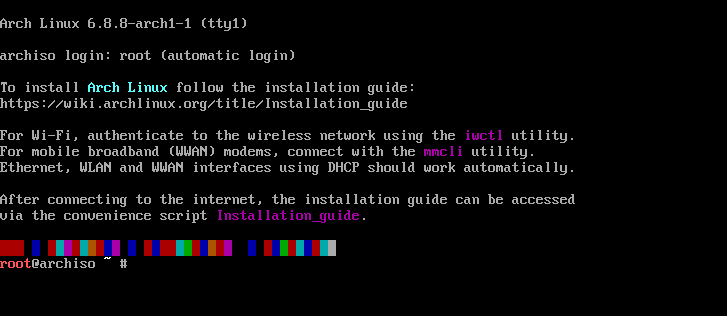

# Arch Linux 安装记录


# 前言

正如你已经知道或者即将知道，[Arch Linux](https://archlinux.org/) 是一个非常神奇的 Linux 发行版，这是一个非常值得学习使用的系统。

[archinstall](https://github.com/archlinux/archinstall) 是一个使用 Python 写的[ Arch Linux 安装向导程序](https://wiki.archlinux.org/title/Archinstall)，可以很方便地使用 `archinstall` 安装 Arch Linux。从 Arch Linux 2022.05.01版本开始，默认集成了 `archinstall` 工具。

# 准备

在[下载页面](https://archlinux.org/download/)下载最新的 iso 镜像文件，国内用户推荐使用清华大学的镜像：

[https://mirrors.tuna.tsinghua.edu.cn/archlinux/iso/latest/archlinux-x86_64.iso](https://mirrors.tuna.tsinghua.edu.cn/archlinux/iso/latest/archlinux-x86_64.iso)

下载后准备一个 U 盘，使用写入工具制作安装盘，比如 [Rufus](https://rufus.ie/zh/) （仅支持 Windows 运行），其他方法可参考[这里](https://wiki.archlinux.org/title/USB_flash_installation_medium_(%E7%AE%80%E4%BD%93%E4%B8%AD%E6%96%87))。

_注意，进行实机安装需要确认主板 BIOS 的相关设置，比如快速启动、安全启动等，否则可能会导致无法安装或安装完后无法进入系统。_

# 启动




# 参考

* [官网](https://archlinux.org/)
* [官方Wiki](https://wiki.archlinux.org/)
* [archlinux 简明指南](https://arch.icekylin.online/)

# 常用

## 基本配置

### 1. 禁用 reflector 服务

Arch Linux 中 `reflector` 服务会自己更新 `mirrorlist`（软件包管理器 `pacman` 的软件源）。比较建议手动设置镜像源列表，通过以下命令将该服务禁用：

```bash
sudo systemctl stop reflector.service
```

### 2. 配置国内软件仓库镜像源

使用 `vim` 编辑器修改 `/etc/pacman.d/mirrorlist` 文件。将 `pacman` 软件仓库源更换为国内软件仓库镜像源：

```bash
sudo vim /etc/pacman.d/mirrorlist
```

推荐的镜像源：
```text
# 中国科学技术大学开源镜像站
Server = https://mirrors.ustc.edu.cn/archlinux/$repo/os/$arch
# 清华大学开源软件镜像站
Server = https://mirrors.tuna.tsinghua.edu.cn/archlinux/$repo/os/$arch
```

### 3. 安装 AUR 助手

[Yay](https://github.com/Jguer/yay) 是一个 AUR 助手工具，AUR 作为 Arch 用户软件仓库，包含了大量用户主导的软件。AUR 软件安装时需要下载依赖、源码进行构建，速度较慢。

```bash
sudo pacman -S yay
```

注意 yay 在构建包的时候会用到 base-devel 软件包，如安装系统时未安装，需安装此包。

### 4. 添加 archlinuxcn 源

[Arch Linux 中文社区仓库](https://www.archlinuxcn.org/)是一个非官方的用户仓库，包含大量中文用户常用的软件、工具、字体/美化包等。与 AUR 仓库不同，archlinuxcn 仓库为已构建好的软件包。

推荐的镜像源：

```text
# 中国科学技术大学开源镜像站
Server = https://mirrors.ustc.edu.cn/archlinuxcn/$arch
# 清华大学开源软件镜像站
Server = https://mirrors.tuna.tsinghua.edu.cn/archlinuxcn/$arch
```

快速操作：

```bash
# 修改/etc/pacman.conf
echo -e &#34;\n[archlinuxcn]\nServer = https://mirrors.tuna.tsinghua.edu.cn/archlinuxcn/\$arch\n\n&#34; | sudo tee -a /etc/pacman.conf

# 导入GPG key
sudo pacman -Sy archlinuxcn-keyring
```

注意，在 2023 年 12 月后，在新系统下安装 `archlinuxcn-keyring` 时可能会出现错误：

```text
error: archlinuxcn-keyring: Signature from &#34;Jiachen YANG (Arch Linux Packager Signing Key) &#34; is marginal trust
```

需要在本地信任 farseerfc 的 GPG key：

```bash
sudo pacman-key --lsign-key &#34;farseerfc@archlinux.org&#34;
```

### 5. 注意事项

AUR 仓库和 archlinuxcn 仓库是用户主导的软件包，使用时需注意区分相同软件的不同构建，以及更新情况等。

## 常用配置

### 1. git

安装：

```bash
sudo pacman -S git
```

配置：

```bash
git config --global user.name &#34;&lt;用户名&gt;&#34;
git config --global user.email &#34;&lt;邮箱&gt;&#34;

# 或 直接编辑
vim ~\.gitconfig
```

配置文件参考：

```text
[user]
        name = xxx
        email = xxx@xxx.com
[http &#34;https://github.com&#34;]
        proxy = socks5://127.0.0.1:xx
[http]
        lowSpeedLimit = 0
        lowSpeedTime = 999999
```

### 2. proxy

安装 v2rayA：

```bash
sudo pacman -S v2raya
```

配置 v2rayA：

安装后启动服务：

``` bash
sudo systemctl enable --now v2raya
```

随后在开始菜单中搜索 v2rayA，点击即可打开浏览器页面，或在浏览器中打开`http://127.0.0.1:2017`。

终端代理：

可以通过 export 命令设置当前终端的代理方式：

```bash
export https_proxy=http://127.0.0.1:8889
export http_proxy=http://127.0.0.1:8889
export all_proxy=http://127.0.0.1:8889
```

推荐使用命令行代理工具 proxychains-ng：

```bash
# 安装
sudo pacman -S proxychains-ng
# 使用
proxychains4 git clone &lt;url&gt;
```

在使用 proxychains-ng 时会在第一句输出配置文件位置，可编辑代理配置加入 `[ProxyList]` 中。

```text
[ProxyList] 
socks5  127.0.0.1 xxxx
http    127.0.0.1 xxxx
```

### 3. zsh

安装：

```bash
sudo pacman -S zsh
```

配置为当前用户默认 shell（注意不要加 sudo）：

```bash
chsh -s /usr/bin/zsh
```

美化（[Oh My ZSH](https://ohmyz.sh/)）：

```bash
# curl
sh -c &#34;$(curl -fsSL https://raw.githubusercontent.com/ohmyzsh/ohmyzsh/master/tools/install.sh)&#34;
# wget
sh -c &#34;$(wget https://raw.githubusercontent.com/ohmyzsh/ohmyzsh/master/tools/install.sh -O -)&#34;
```

安装成功后可编辑`~/.zshrc`，修改主题`ZSH_THEME=&#34;ys&#34;`。

## 字体

中文字体包[参考](https://wiki.archlinux.org/title/Localization/Chinese#Fonts)，中文配置[参考](https://wiki.archlinux.org/title/Localization/Simplified_Chinese)，字体调校[参考](https://szclsya.me/zh-cn/posts/fonts/linux-config-guide/)。为省事可直接参考本文 [[#3. 字体调教 | 字体调教]] 部分。

### 1. 中文字体

简体中文：

```bash
# 思源 &amp; 谷歌
sudo pacman -S noto-fonts noto-fonts-cjk noto-fonts-emoji
# 文泉驿
sudo pacman -S wqy-microhei wqy-zenhei wqy-bitmapfont
```

### 2. 等宽字体

编程字体一般是使用等宽字体，下面记录一些比较流行的字体，nerd 表示字体集成了 [Nerd Fonts](https://www.nerdfonts.com/) 图标字体。

中文字体：
```text
ttf-sarasa-gothic
```

拉丁字体：

```text
# https://archlinux.org/packages/extra/any/nerd-fonts/
ttf-hack-nerd
ttf-firacode-nerd
ttf-jetbrains-mono-nerd
ttf-cascadia-code-nerd
ttf-sourcecodepro-nerd
ttf-iosevka-nerd
```

### 3. 字体调教

拉丁字体：
- [**Inter**](https://rsms.me/inter/) - 无衬线
- **Noto Serif** - 衬线
- **Sarasa Term SC** - 等宽（为较瘦的字体风格，类似 **Iosevka Term**，如果不适应可以尝试使用 **Adobe Source Pro** ， **Cascadia Code** 或 **Fira Code** ）

中文字体
 - **Noto Sans CJK SC** （又称 思源黑体）
 - **Noto Serif CJK SC** （又称 思源宋体）

```bash
sudo pacman -S noto-fonts noto-fonts-cjk noto-fonts-emoji inter-font ttf-sarasa-gothic
```

参考编辑 [fonts.conf](fonts.conf) 或 [github fonts.conf](https://github.com/szclsya/dotfiles/blob/master/fontconfig/fonts.conf)，配置文件为 `~/.config/fontconfig/fonts.conf`, 设置后重新登录。

## 输入法

- `fcitx5-im`: fcitx5 输入法框架包
- `fcitx5-chinese-addons`: 安装中文输入法
- `fcitx5-pinyin-zhwiki`: 安装词库
- `fcitx5-material-color fcitx5-nord`: 安装美化包

```bash
# 安装输入法
sudo pacman -S fcitx5-im fcitx5-chinese-addons fcitx5-pinyin-zhwiki fcitx5-material-color fcitx5-nord

# 配置环境变量
echo -e &#34;\nGTK_IM_MODULE=fcitx\nQT_IM_MODULE=fcitx\nXMODIFIERS=@im=fcitx&#34; | sudo tee -a /etc/environment
```

前往 `Fcitx5设置 -&gt; 配置附加组件 -&gt; 经典用户界面 -&gt; 主题` 设置主题。

## 常用软件

- `neofetch`: 查看系统信息
- `vim`: 实用文本编辑器
- `btop`: 终端系统监控
- `screenkey`: 显示按下的键
- `tree`: 用树状的形式展示目录结构
- `flameshot`: 截图工具
- `obs-studio`: 录屏


---

> 作者: [J](https://wind-j.github.io)  
> URL: https://wind-j.github.io/posts/archlinux%E8%AE%B0%E5%BD%95/  

